# 🌐 Welcome to the Solace Agent Mesh Workshop

> **Before You Begin:**  
> You’ll need a GitHub account to participate in this workshop.  
> Don’t have one yet? Follow these quick steps:
> - Visit [GitHub](https://github.com/)
> - Click **Sign up** or **Continue with Google**
> - Follow the prompts to complete setup

This guide walks you through setting up **GitHub Codespaces** and installing **Solace Agent Mesh (SAM)** for the workshop.

---

## 🧩 1. Setup GitHub Codespace

1. **Open the Workshop Repository**  
   Visit [Solace Developer Workshops](https://github.com/SolaceDev/solace-developer-workshops/)  
   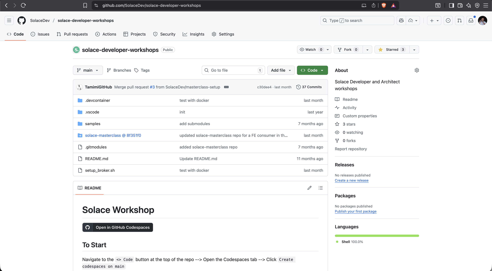

2. Click **Open in GitHub Codespaces**  
   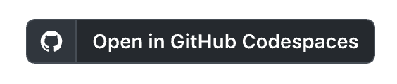

3. Choose **Change Options** → set machine type to **4-core**  
   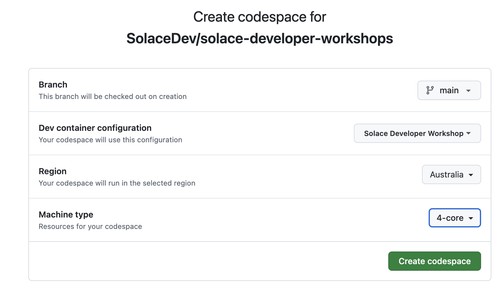

4. Click **Create Codespace**  
   Once it’s ready, you’ll see Visual Studio Code running in your browser — your personal VM workspace.  
   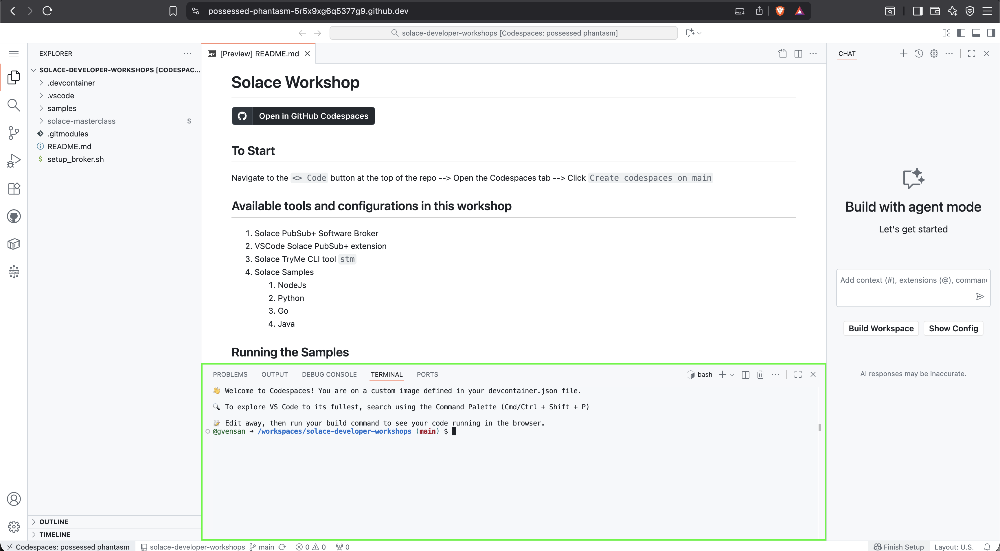

---

## ⚙️ 2. Install Solace Agent Mesh (SAM)

1. Launch the **Codelab** provided for this workshop and start with **Install SAM CLI**.  
   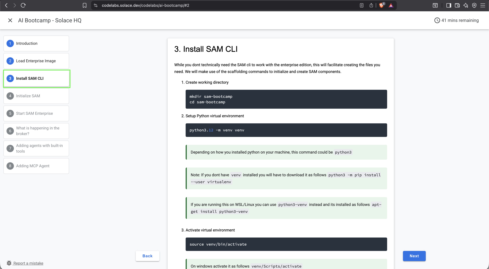

2. Follow the on-screen steps to:
   - Create and activate a virtual environment
   - Install `solace-agent-mesh`

> 💡 Tip: You can close the chat panel on the right after installation.

---

## 🚀 3. Initialize Solace Agent Mesh

1. Run the **Initialize SAM** command from the Codelab.  
   This opens a browser portal — click **Open in Browser** (or use Cmd/Ctrl + Click).  
   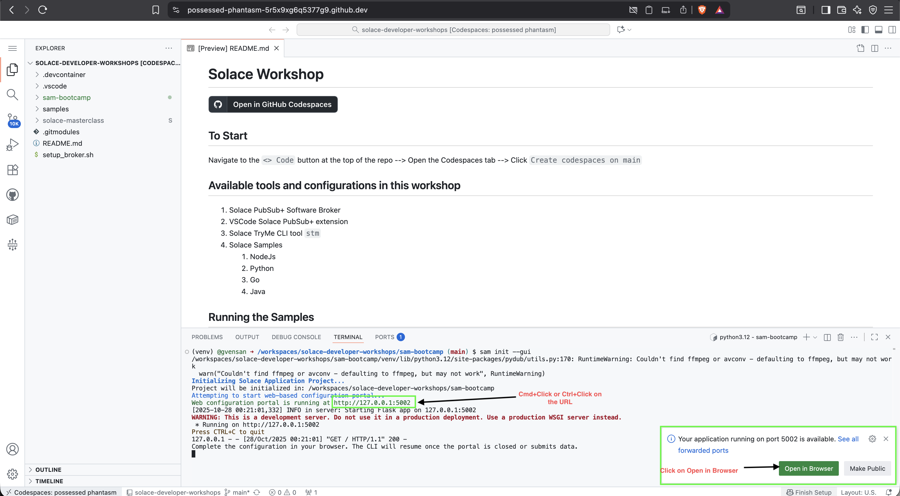

> You can follow the Codelab section *Initialize SAM*, but pay special attention to these two steps:

### Step 2: Broker Setup
- Log in to your **Solace Cloud Console**
- Navigate to **Cluster Manager → Connect**
  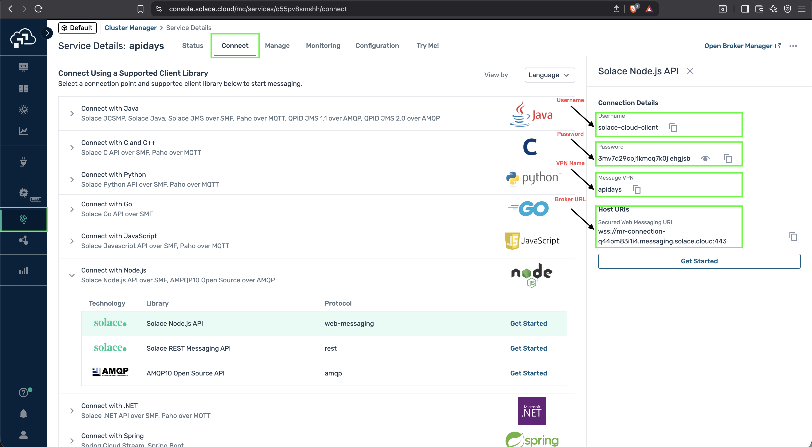
- Keep **Broker Type** as *Existing Solace Pub/Sub+ Broker*
- Copy connection details into the **Broker Setup** screen  
  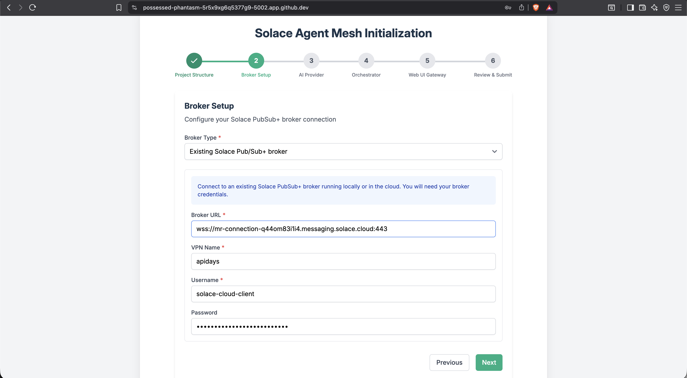

### Step 3: AI Provider
- Choose **OpenAI Compatible Provider**
- Set **LLM Endpoint URL** to `https://lite-llm.mymaas.net`
- Enter the **LLM API Key** shared during the workshop
- Select **bedrock-anthropic-claude-3-5-sonnet** from the model dropdown  
  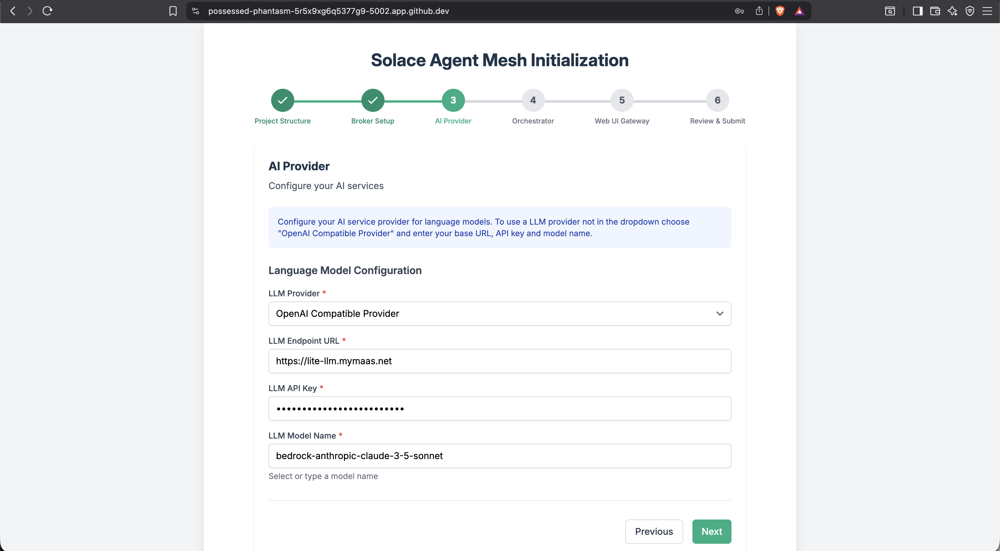

After initialization completes, you’ll see confirmation in your Codespaces terminal:  
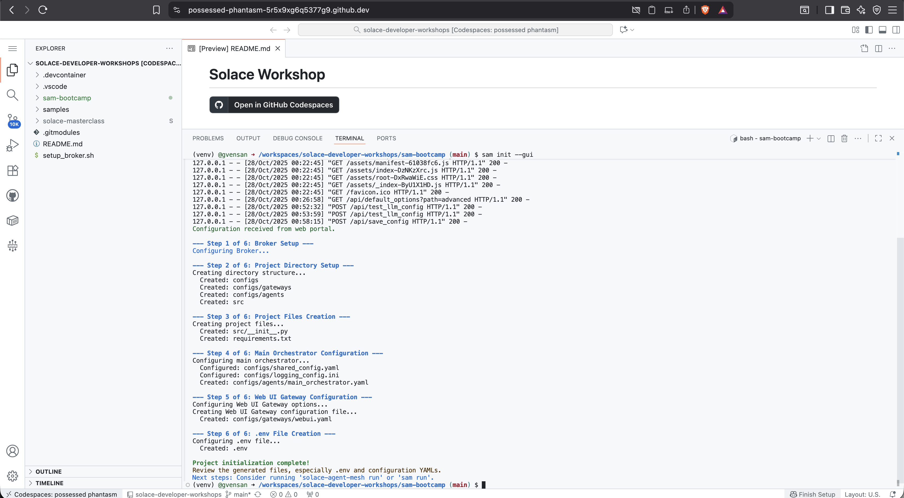

---

## ▶️ 4. Start Solace Agent Mesh

The **Start SAM Enterprise** section in the Codelab explains enterprise usage — here we’ll use the **Community Edition**.

1. Check installation:
   ```bash
   sam -version
   ```

2. Start SAM:
   ```bash
   sam run
   ```

You’ll see logs as the system starts:  
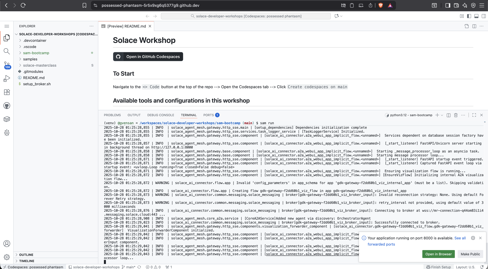

> ⚠️ **Note:** When prompted to open a port (8080), wait until logs stabilize, then open the browser view or use the URL `http://127.0.0.1:8000`.

Your Solace Agent Mesh Chat interface will now appear:  
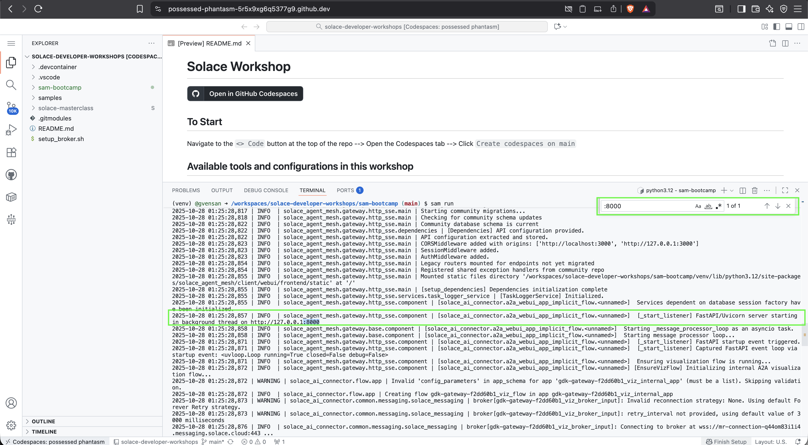  
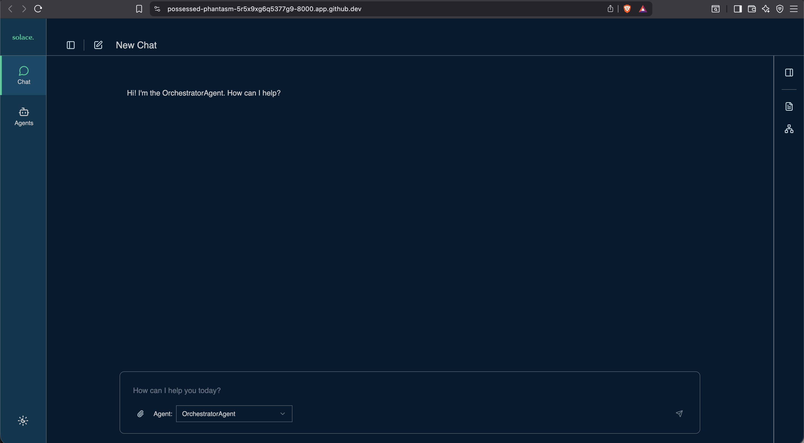

---

## 🤖 5. Explore and Install Agents

Try interacting with SAM:

```
What agents do you have access to and what are their capabilities?
```

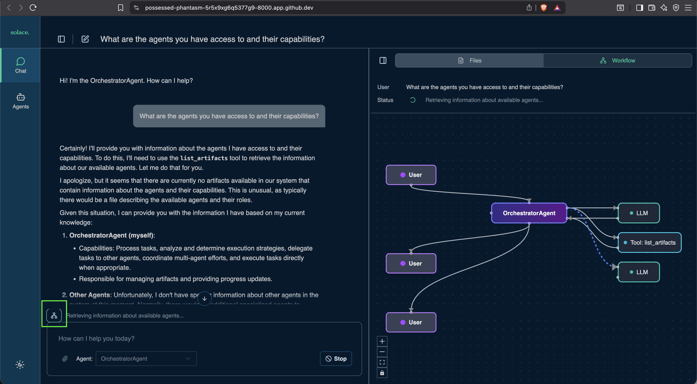

You can visualize agent interactions (e.g., **Orchestrator ↔ LLM**) by clicking the **network** icon below any chat response.

> 💬 As you install more agents, you can always ask SAM for a list of available agents and capabilities.

---

### ✅ That’s It!
You’ve successfully:
- Set up GitHub Codespaces  
- Installed and initialized Solace Agent Mesh  
- Started your own SAM instance  
- Explored agent capabilities  

> 🧠 Next step: Try deploying additional agents and experiment with **Agent-to-Agent (A2A)** communication.

---

**For questions or troubleshooting:**  
Ask during the workshop or visit [solace.dev](https://solace.dev).

---

*© 2025 Solace Developer Workshops — For educational use only.*
