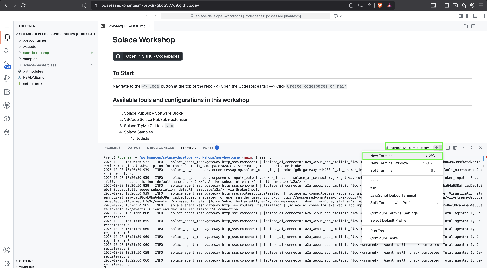
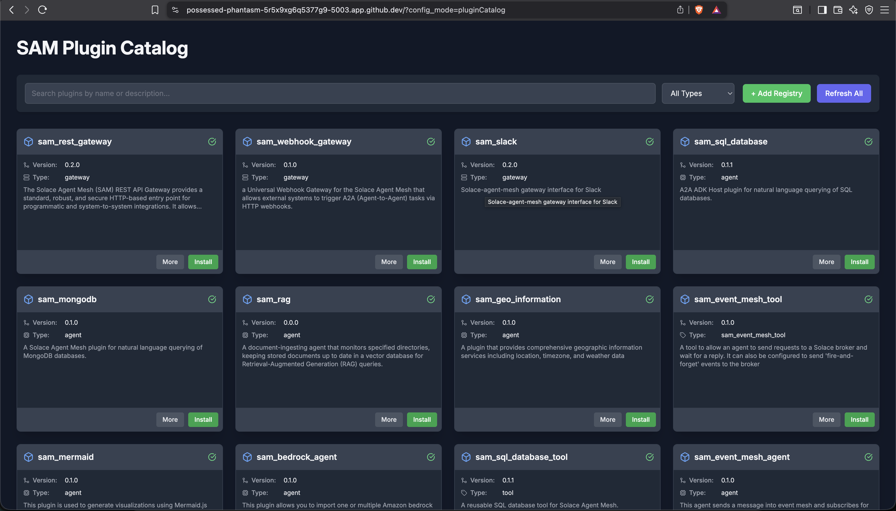
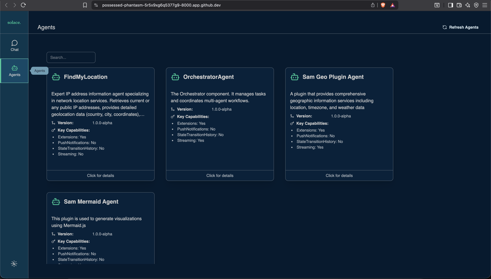
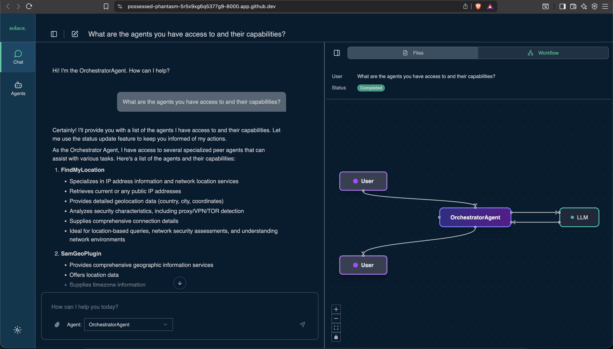

# 🌐 Welcome to the Solace Agent Mesh Workshop

> **Before You Begin:**  
> You’ll need a GitHub account to participate in this workshop.  
> Don’t have one yet? Follow these quick steps:  
> - Visit [GitHub](https://github.com/)  
> - Click **Sign up** or **Continue with Google**  
> - Follow the prompts to complete setup

This guide walks you through setting up **GitHub Codespaces** and installing **Solace Agent Mesh (SAM)** for the workshop.

---

## 🧩 1. Setup GitHub Codespace

1. **Open the Workshop Repository**  
   Visit [Solace Developer Workshops](https://github.com/SolaceDev/solace-developer-workshops/)  
   

2. Click **Open in GitHub Codespaces**  
   

3. Choose **Change Options** → set machine type to **4-core**  
   

4. Click **Create Codespace**  
   Once it’s ready, you’ll see Visual Studio Code running in your browser — your personal VM workspace.  
   

---

## ⚙️ 2. Install Solace Agent Mesh (SAM)

1. Launch the **Codelab** provided for this workshop and start with **Install SAM CLI**.  
   

2. Follow the on-screen steps to:  
   - Create and activate a virtual environment  
   - Install `solace-agent-mesh`

> 💡 Tip: You can close the chat panel on the right after installation.

---

## 🚀 3. Initialize Solace Agent Mesh

1. Run the **Initialize SAM** command from the Codelab.  
   This opens a browser portal — click **Open in Browser** (or use Cmd/Ctrl + Click on the link in the log, e.g., `http://127.0.0.1:8000`).  
   

> You can follow the Codelab section *Initialize SAM*, but pay special attention to these two steps:

### Step 2: Broker Setup
- Log in to your **Solace Cloud Console**  
- Navigate to **Cluster Manager → Connect**  
  
- Keep **Broker Type** as *Existing Solace Pub/Sub+ Broker*  
- Copy connection details into the **Broker Setup** screen  
  

### Step 3: AI Provider
- Choose **OpenAI Compatible Provider**
- Set **LLM Endpoint URL** to `https://lite-llm.mymaas.net`
- Enter the **LLM API Key** shared during the workshop
- Select **bedrock-anthropic-claude-3-5-sonnet** from the model dropdown  
  

After initialization completes, you’ll see confirmation in your Codespaces terminal:  


---

## ▶️ 4. Start Solace Agent Mesh

The **Start SAM Enterprise** section in the Codelab explains enterprise usage — here we’ll use the **Community Edition**.

1. Check installation:
   ```bash
   sam -version
   ```

2. Start SAM:
   ```bash
   sam run
   ```

You’ll see logs as the system starts:  


> ⚠️ **Note:** When prompted to open a port (8080), wait until logs stabilize, then open the browser view or use the URL `http://127.0.0.1:8000`.

Your Solace Agent Mesh Chat interface will now appear:  
  


---

## 🤖 5. Explore Agents

Now, let’s interact with SAM.

Enter in the chat area:
```
What agents do you have access to and what are their capabilities?
```


You can visualize agent interactions (e.g., **Orchestrator ↔ LLM**) by clicking the **network** icon below any chat response.

> 💬 As you install more agents, you can always ask SAM for a list of available agents and capabilities.

---

## ▶️ 6. Install Agents

While Solace Agent Mesh is running in the current terminal, open a **new terminal** and launch the plugin catalog to add new agents.



Solace provides a set of reusable, open-source agents. SAM makes it easy to install agents from these repositories with just a few clicks.

- **SolaceLabs Core Plugins:**  
  https://github.com/SolaceLabs/solace-agent-mesh-core-plugins  
- **SolaceCommunity Plugins:**  
  https://github.com/solacecommunity/solace-agent-mesh-plugins  

> **Note:** The SolaceCommunity repository is open source and contains community-contributed agents — we encourage contributions!

### Steps

1. In the terminal, navigate to your SAM workspace and activate the environment:
   ```bash
   cd sam-bootcamp
   source venv/bin/activate
   ```

2. Launch the plugin catalog:
   ```bash
   sam plugin catalog
   ```

   This opens the catalog portal in your browser (typically `http://127.0.0.1:5003/?config_mode=pluginCatalog`).  
   

3. Review available agents and their capabilities by clicking **More** on each tile.

4. Add the following registries:  
   - **SolaceLabs Repository:**  
     - URL: `https://github.com/SolaceLabs/solace-agent-mesh-core-plugins`  
     - Name: `SolaceLabs`
   - **SolaceCommunity Repository:**  
     - URL: `https://github.com/solacecommunity/solace-agent-mesh-plugins`  
     - Name: `SolaceCommunity`

5. Click **Refresh** to load all available agents.

6. Install these example agents:  
   - `sam_geo_information`  
   - `sam_mermaid`  
   - `find_my_ip`  

> Give each agent a meaningful name (e.g., use hyphens instead of underscores).

When done, you can close the SAM catalog tab and stop the process with `Ctrl+C`.

---

## ▶️ 7. Running Agents

You have two options:

a) **Restart SAM:**  
   Stop the process with `Ctrl+C` and run again:  
   ```bash
   sam run
   ```

b) **Run agents individually:**  
   ```bash
   sam run <agent_yaml_file>
   ```

This allows agents to run independently — even on different machines — much like microservices.

For this lab, stop the current process and restart SAM in the first terminal.

---

## ▶️ 8. Review the Registered Agents

In the SAM Chat console, click the **Agents** tool on the left sidebar. You should now see the newly registered agents alongside the **Orchestrator** agent.  



Click **Click for details** on any agent card to learn more about its configuration and skills.

Now, let’s interact again with SAM:

```
What agents do you have access to and what are their capabilities?
```



You can visualize agent interactions (e.g., **Orchestrator ↔ LLM**) by clicking the **network** icon below any chat response.

---

## ▶️ 9. Try Sample Queries

Try these sample prompts in your SAM chat:

```
What is the weather around me today?
```

```
Create a bar chart showing the population of the five largest cities in Australia.
```

Or something fun:

```
Create a simple flowchart showing the steps to make a cup of tea.
```

The more diverse the agents, the richer your conversational analytics experience — all powered by **Solace Event Mesh**.

Yes, we’ll discuss the role of Event Mesh in Solace Agent Mesh during the session.

---

### ✅ That’s It!
You’ve successfully:  
- Set up GitHub Codespaces  
- Installed and initialized Solace Agent Mesh  
- Started your own SAM instance  
- Explored and installed agents  

> 🧠 Next step: Try deploying additional agents and experiment with **Agent-to-Agent (A2A)** communication.

---

### 📚 Additional Resources

- [Solace Agent Mesh GitHub Repository](https://github.com/SolaceLabs/solace-agent-mesh)  
- [Official Solace Agent Mesh Documentation](https://docs.solace.dev/agent-mesh/)  
- [Solace Developer Portal](https://solace.dev)  

---

**For questions or troubleshooting:**  
Ask during the workshop or visit [Solace Agent Mesh Documentation](https://solacelabs.github.io/solace-agent-mesh/docs/documentation/getting-started/introduction/) or ask in [Solace Community](https://community.solace.com/c/solace-agent-mesh/16).

---

*© 2025 Solace Developer Workshops — For educational use only.*
